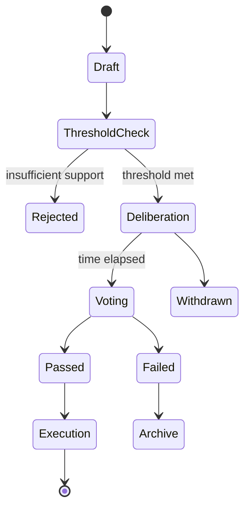
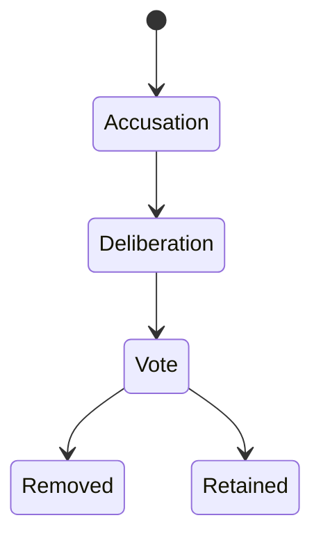

# CommonGround Governance Specification

## Overview
This document defines the formal governance model for CommonGround, including entities, state machines, and decision logic.

---

## Core Entities

### Member
- id
- reputation (optional)
- memberships
- permissions

### Delegation
- id
- scope (local, domain, global)
- holder
- powers
- start_time
- stability_window
- revocable: true

### Proposal
- id
- proposer
- scope
- type
- status
- timestamps

### Referendum
- id
- proposal_id
- electorate
- quorum
- thresholds
- votes
- result

### Deliberation
- id
- proposal_id
- arguments
- perspectives
- synthesis

---

## Proposal Lifecycle



---

## Core Rules

### Threshold Rule

```
if support_count < min_threshold(scope):
    reject proposal
```

### Rate Limiting

```
if proposals_in_window(member) > limit:
    block proposal
```

### Stability Window

```
if current_time < delegation.start_time + stability_window:
    reject unless emergency
```

### Scope (Subsidiarity)

```
electorate = affected_members(scope)
```

### Quorum

```
if votes < quorum:
    result = invalid
```

---

## Removal Process



---

## Key Principles

- Revocability of power
- Structured deliberation before voting
- Subsidiarity (local decision-making)
- Temporal stability
- Participation integrity
